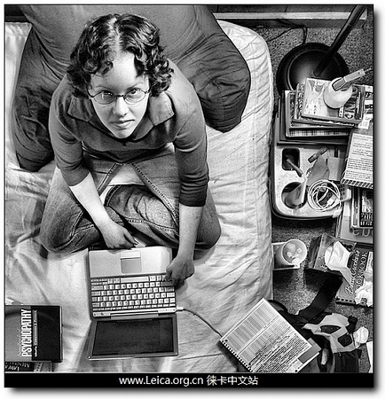
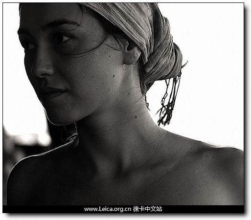
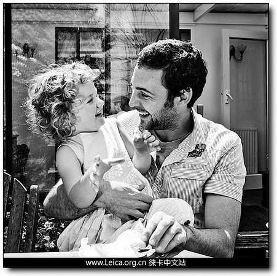
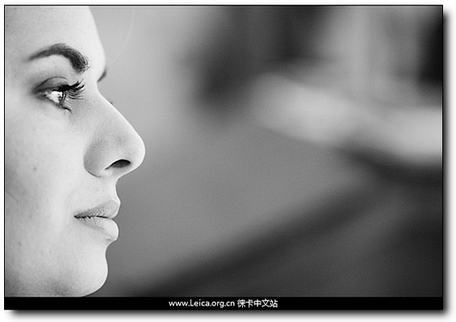
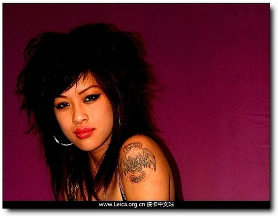
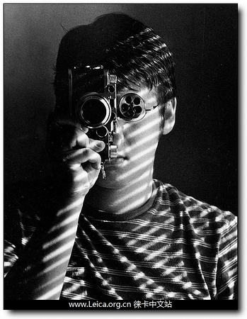
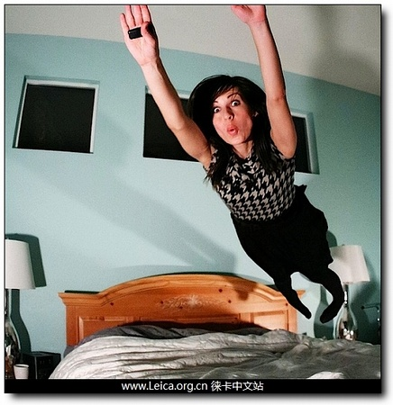
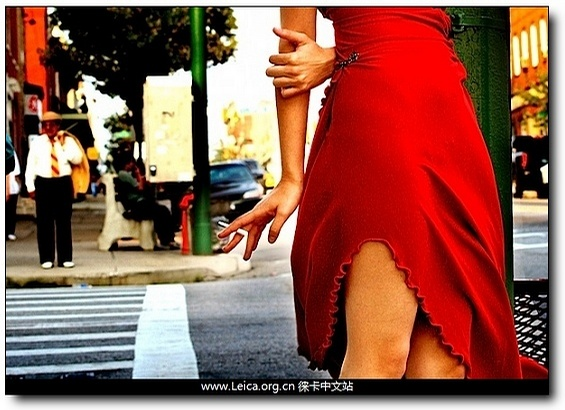
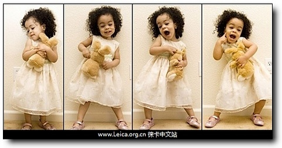

>原文：http://www.leica.org.cn/post/792/

人是镜头前永远的主题，我们已经分享过不少拍摄人像的文章，总结性的例如[国家地理10个经典肖像](http://leica.org.cn/read.php/616.htm)，[人像摄影中的13个拍摄灵感](http://leica.org.cn/read.php/488.htm)，[给自己拍一张肖像：Top5](http://leica.org.cn/read.php/671.htm)，小Tips则不妨重温一下[肩部](http://leica.org.cn/read.php/616.htm)和[用光](http://leica.org.cn/read.php/664.htm)的技巧，下面这一篇中，有不少其实已经很经典的idea，只是以另一种运用的方式呈现出来。

改变视角
---

绝大多数人像照片都是在与眼睛平行的高度拍摄，换一个角度往往能完全改变一张照片的表现力，所以很多摄影老手都会告诉你：不妨站在你能达到的最高点。当然，放低机位也会达到同样的目的。

改变模特的眼神
---

人物的眼睛往往是画面中最重要的部分，绝大多数肖像拍摄中模特都注视着镜头，自然而然地引起观看者与被拍摄者的“交流”；这种特殊的“指向性”如果利用得当，有时会获得特别的效果，不过，这种“指向”会直接影响到构图，如果无构图上的必要则切忌牵强，否则产生被拍摄者与摄影者“貌合神离”的感觉。

眼神成为了构图的延伸

同一构图中的眼神交流

打破构图常规
---

打破经典的构图常规（三分法则）不仅仅需要勇气，还需要对场景的理解，如果你需要构成一种强势冲击力的效果，不妨尝试将模特放在画面的边缘。

如果没有眼神的“指向”，这张照片将非常失败（很快就复习到刚才的要点:）

将模特至于画面的左侧，注意模特姿势对构图的影响

尝试特殊的用光
---

人像中有无数种用光的方式，侧光可以烘托气氛，双闪灯可以突出轮廓，当然还有各种创意光影方式，夜晚拍摄时别忘了B门哦

设计特别的动作
---

人像摄影是模特和摄影师共同完成的作品，一张精心策划的照片必然比呆板的拍摄更容易引起人们的关注，你可以利用模特的各种动作来构建你的画面，奔跑、跳跃都是非常棒的主题，当然，前提是你要准备好一台具有连拍功能的单反。

拍摄模特的局部特写
---

这是以前重复过很过很多很过很多很多遍以至于已经成为经典的技巧了，不过，并不是所有人都能真正拍出漂亮的特写照片，原因？参考第1条关于视角的要点

拍一组照片
---

传说中的以量取胜可不是简单的连拍，如何从上百张照片里选取几张组成一幅作品是最考验后期编辑功底的事情，每一种排列都能产生特别的意味，答案并不唯一，但是每一个选择都体现了你对构图和故事的理解——这可不是技巧能够解决的问题。

